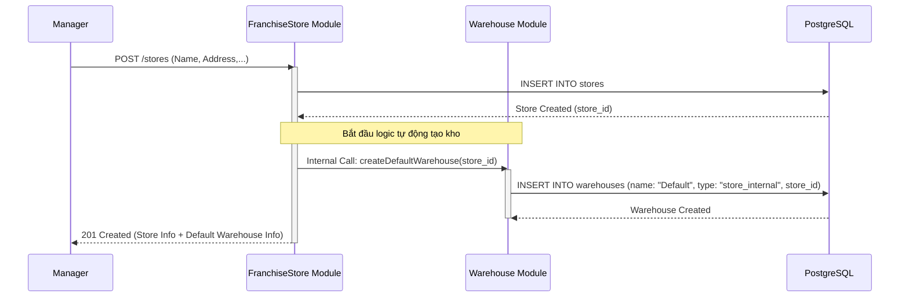

Chào bạn, với tư cách là Tech Lead, tôi đồng ý với cách tiếp cận này. Việc tách riêng module `franchise_store` là hoàn toàn hợp lý để quản lý thực thể "Cửa hàng" một cách độc lập, giúp việc mở rộng sau này (như quản lý doanh thu, địa điểm, hợp đồng franchise) trở nên dễ dàng hơn.

Dưới đây là phân tích chi tiết các endpoint cho module **Franchise Store** và logic tự động hóa đi kèm, tuân thủ nguyên tắc **ISTJ (thực tế, logic, tập trung giải pháp)**.

---

### 1. Phân tích Logic Nghiệp vụ (Business Logic)

- **Ràng buộc 1-1 (Ban đầu):** Mỗi khi một `Store` được tạo ra, hệ thống **bắt buộc** phải tự động tạo một `Warehouse` mặc định thuộc sở hữu của Store đó. Loại kho này sẽ là `store_internal`.
- **Mục đích:** Để đảm bảo luồng **Fulfillment** (Bếp trung tâm giao hàng cho Store) có nơi để "đổ" hàng vào ngay lập tức mà không cần Coordinator phải tạo kho thủ công.
- **Mở rộng:** Sau khi Store đã tồn tại, Manager có quyền tạo thêm các kho phụ (ví dụ: Kho lạnh, Kho khô riêng biệt) thông qua module Warehouse.

---

### 2. Danh sách Endpoints Chi tiết

#### A. Module: `franchise-store` (Quản lý Cửa hàng)

| Method   | Endpoint  | Actor       | Mô tả logic nghiệp vụ   |
| -------- | --------- | ----------- | ----------------------- |
| **POST** | `/stores` | **Manager** | **Tạo Store mới.**   |

 1. Lưu thông tin Store vào DB.  

 2. **[Auto-Trigger]:** Tự động tạo 1 Warehouse tên là "Kho mặc định - [Tên Store]" với `type: store_internal`. |
| **GET** | `/stores` | **Manager, Coordinator** | **Lấy danh sách Store.**  

 Hỗ trợ filter theo khu vực, trạng thái hoạt động. |
| **GET** | `/stores/:id` | **Manager** | **Xem chi tiết Store.**  

 Bao gồm thông tin cơ bản và danh sách các kho hiện có của Store đó. |
| **PATCH** | `/stores/:id` | **Manager** | **Cập nhật thông tin.**  

 Chỉ cập nhật metadata (tên, địa chỉ, số điện thoại). Không cho phép đổi `store_id` để tránh sai lệch data tồn kho. |
| **DELETE** | `/stores/:id` | **Manager** | **Ngừng hoạt động (Soft Delete).**  

 Chuyển trạng thái `active: false`. Không xóa vật lý vì liên quan đến Transaction lịch sử. |

#### B. Module: `warehouse` (Bổ trợ cho Franchise Store)

Sau khi Store đã có, Manager quản lý kho thông qua các endpoint này:

| Method   | Endpoint      | Actor       | Mô tả logic nghiệp vụ               |
| -------- | ------------- | ----------- | ----------------------------------- |
| **POST** | `/warehouses` | **Manager** | **Tạo kho bổ sung cho Store.**   |

 Dùng khi Store muốn tách riêng kho (VD: Kho chứa đồ đông lạnh riêng). Yêu cầu `storeId`. |
| **GET** | `/warehouses` | **Manager, Coordinator** | **Xem danh sách kho.**  

 Query param `?storeId=xxx` để lọc kho thuộc chi nhánh cụ thể. |
| **GET** | `/warehouses/:id/inventory` | **Manager, Store Staff** | **Xem tồn kho theo Batch.**  

 Theo đúng nguyên tắc: Inventory = Warehouse + Batch. |

---

### 3. Luồng xử lý dữ liệu (Sequence Diagram)

Dưới đây là logic khi Manager tạo một Cửa hàng mới:

---

### 4. Cấu trúc Database (Logic Schema)

Để hỗ trợ các endpoint này, bảng `stores` và `warehouses` sẽ liên kết như sau:

- **Table `stores`:**
- `id`: UUID (Primary Key)
- `name`: String
- `address`: Text
- `is_active`: Boolean (Default: true)

- **Table `warehouses`:**
- `id`: UUID (Primary Key)
- `store_id`: UUID (Foreign Key -> stores.id, **Nullable** vì Bếp trung tâm cũng có kho nhưng không thuộc Store nào).
- `type`: Enum (`central`, `store_internal`)
- `name`: String (Ví dụ: "Kho tổng", "Kho chi nhánh Q1")

### 5. Review từ Tech Lead

1. **Tính nhất quán (Atomic):** Việc tạo Store và tạo Warehouse mặc định phải nằm trong một **Database Transaction**. Nếu tạo Warehouse lỗi, phải Rollback việc tạo Store.
2. **Phân quyền (RBAC):** \* Manager được tạo Store.

- Franchise Store Staff **không** được gọi các endpoint này. Họ chỉ được phép `GET /warehouses/:id/inventory` của kho mình.

3. **Tên kho tự động:** Nên đặt quy tắc đặt tên kho tự động (VD: `[STORE_NAME] - Main Warehouse`) để Supply Coordinator dễ dàng nhận diện trên hệ thống Web Admin.
