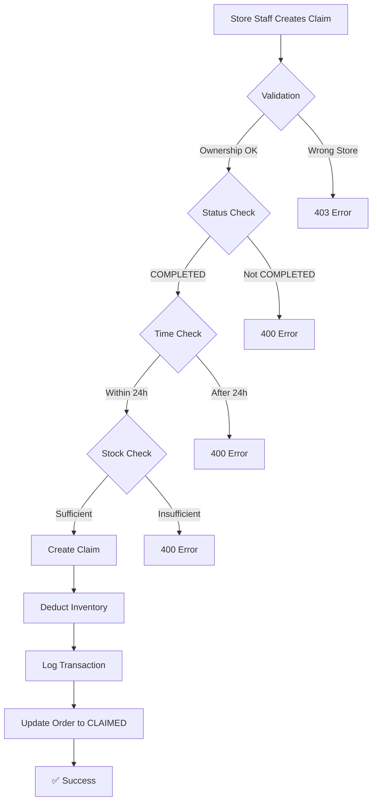

# Manual Claim - Quick Reference Guide

## 🎯 Business Rules Summary

| Rule            | Description                                   | Time Limit  |
| --------------- | --------------------------------------------- | ----------- |
| **Ownership**   | Only create claims for YOUR store's shipments | N/A         |
| **Status**      | Shipment must be COMPLETED                    | N/A         |
| **Time Window** | Within 24 hours from completion               | 24h ⏰      |
| **Inventory**   | Claimed qty immediately deducted from stock   | Instant     |
| **Evidence**    | Damaged goods MUST have photo proof           | Required 📸 |

---

## 🚀 API Endpoint

### Create Manual Claim

```http
POST /claims
Authorization: Bearer <token>
Content-Type: application/json

{
  "shipmentId": "uuid",
  "items": [
    {
      "productId": 123,
      "batchId": 456,
      "quantityMissing": 0,
      "quantityDamaged": 5,
      "reason": "Hàng bị hỏng trong quá trình vận chuyển",
      "imageProofUrl": "https://..."  // Required if quantityDamaged > 0
    }
  ]
}
```

**Success Response:**

```json
{
  "success": true,
  "message": "Tạo khiếu nại thành công. Tồn kho đã được điều chỉnh.",
  "data": {
    "id": "claim-uuid",
    "shipmentId": "shipment-uuid",
    "status": "pending",
    "createdAt": "2026-02-12T20:00:00Z"
  }
}
```

---

## ❌ Common Errors

| Error Code | Error Message                                          | Solution                               |
| ---------- | ------------------------------------------------------ | -------------------------------------- |
| 403        | Bạn không có quyền tạo khiếu nại cho chuyến hàng này   | Check shipment belongs to your store   |
| 400        | Chỉ có thể tạo khiếu nại cho chuyến hàng đã hoàn thành | Wait for shipment to be COMPLETED      |
| 400        | Đã quá thời gian cho phép tạo khiếu nại (24 giờ...)    | Create claim within 24 hours           |
| 400        | Số lượng tồn kho không đủ                              | Check inventory, qty already deducted? |
| 400        | Hàng hỏng bắt buộc phải có ảnh bằng chứng              | Add imageProofUrl for damaged items    |

---

## 🔍 Validation Checklist

Before creating a manual claim, ensure:

- [ ] Shipment status is `COMPLETED`
- [ ] Less than 24 hours since completion
- [ ] Shipment belongs to your store
- [ ] You have enough stock in inventory
- [ ] Photo evidence ready for damaged goods
- [ ] Quantities are correct (quantityMissing + quantityDamaged > 0)

---

## 🏗️ System Behavior

### What Happens When You Create a Claim?



### Inventory Impact Example

**Before Claim:**

- Store Warehouse: Batch #456 → 10kg chicken

**Claim Created:**

- quantityDamaged: 5kg
- quantityMissing: 0kg

**After Claim:**

- Store Warehouse: Batch #456 → **5kg chicken** (immediately deducted)
- Inventory Transaction Log: `-5kg (Manual Claim: Missing: 0, Damaged: 5)`

---

## 🛡️ Security Notes

### Why Store Ownership Validation Matters

**Scenario**: Store A tries to create claim for Store B's shipment

```typescript
// Request from Store A (storeId: "store-a")
POST /claims
{
  "shipmentId": "shipment-belongs-to-store-b",  // ❌ Wrong!
  ...
}

// Response:
403 Forbidden
{
  "message": "Bạn không có quyền tạo khiếu nại cho chuyến hàng này"
}
```

**Protection**: System compares JWT token's `storeId` with shipment's destination store. Prevents malicious claims.

---

## 📊 Performance Notes

### Index Usage

Query for 24-hour window check uses index:

```sql
-- Optimized query
SELECT ... FROM shipments
WHERE status = 'completed'
  AND updated_at >= NOW() - INTERVAL '24 hours'

-- Index: idx_shipments_status_updated_at (status, updated_at)
```

**Expected Performance**:

- Validation query: < 50ms
- Complete claim creation: < 200ms (with inventory updates)

---

## 🧪 Testing Scenarios

### Happy Path

1. Complete a shipment
2. Within 24 hours, create claim with valid data
3. Verify inventory deducted
4. Verify order status = CLAIMED

### Edge Cases

1. **Exactly 24:00:00** - Should succeed
2. **24:00:01** - Should fail
3. **Claim same batch twice** - Should fail (insufficient stock on 2nd try)
4. **Damaged without photo** - Should fail immediately

---

## 🔧 Troubleshooting

### Issue: "Số lượng tồn kho không đủ"

**Possible Causes**:

1. Inventory already adjusted (duplicate request?)
2. Other staff sold the items
3. Concurrent claim creation

**Solution**:

```sql
-- Check current inventory
SELECT quantity FROM inventory
WHERE warehouse_id = YOUR_WAREHOUSE_ID
  AND batch_id = BATCH_ID;

-- Check recent transactions
SELECT * FROM inventory_transactions
WHERE batch_id = BATCH_ID
ORDER BY created_at DESC LIMIT 10;
```

### Issue: "Đã quá thời gian cho phép"

**Possible Causes**:

1. Shipment completed more than 24 hours ago
2. System clock mismatch

**Solution**:

```sql
-- Check shipment completion time
SELECT id, status, updated_at,
       NOW() - updated_at as time_since_completion
FROM shipments
WHERE id = 'YOUR_SHIPMENT_ID';
```

---

## 📝 Code Examples

### TypeScript/NestJS (Frontend Integration)

```typescript
// Create claim service
async createManualClaim(
  shipmentId: string,
  items: ClaimItemDto[]
): Promise<Claim> {
  try {
    const response = await this.httpService.post('/claims', {
      shipmentId,
      items
    });

    // Show success message
    this.toastr.success('Tạo khiếu nại thành công. Tồn kho đã được điều chỉnh.');

    return response.data.data;
  } catch (error) {
    if (error.status === 403) {
      this.toastr.error('Bạn không có quyền tạo khiếu nại cho chuyến hàng này');
    } else if (error.status === 400) {
      this.toastr.error(error.message);
    }
    throw error;
  }
}
```

---

## 📚 Related Documentation

- [Full Implementation Summary](./manual-claim-refactoring-summary.md)
- [Database Schema](../src/database/schema.ts)
- [API Documentation](http://localhost:3000/api)

---

## 🆘 Support

### For Developers

- Check build: `npm run build`
- Run tests: `npm run test`
- Check logs: `docker logs wdp301-api`

### For Business Users

- Contact: Supply Coordinator / Manager
- Time Window: Remember 24-hour limit!
- Evidence: Always prepare photos for damaged goods

---

**Last Updated**: 2026-02-12  
**Version**: 1.0  
**Status**: ✅ Production Ready
