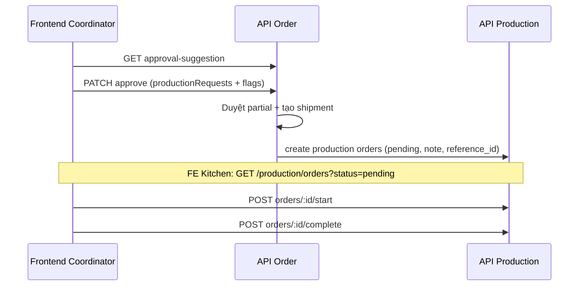

# Tích hợp Frontend: Order (điều phối) & Production (bếp)

Tài liệu này mô tả **endpoint**, **payload**, **luồng nghiệp vụ** và **response** để FE gọi API đúng. Mã nguồn tham chiếu: `src/module/order`, `src/module/production`.

## 1. Chuẩn chung

### 1.1 Base URL & versioning

- **Global prefix:** `wdp301-api` (xem `main.ts`).
- **URI versioning:** `defaultVersion: '1'` — đường dẫn thường có dạng:

  `/{version}/{prefix}/...` → ví dụ: **`/v1/wdp301-api/orders/...`**

  Nếu môi trường của bạn khác, hãy mở Swagger: `{HOST}:{PORT}/wdp301-api/docs` và copy đúng path từng operation.

### 1.2 Auth

- Header: **`Authorization: Bearer <access_token>`**
- Một số route yêu cầu role cụ thể (xem từng bảng bên dưới).

### 1.3 Envelope response (hầu hết route)

`TransformInterceptor` bọc body:

```json
{
  "statusCode": 200,
  "message": "Success",
  "data": { },
  "timestamp": "ISO-8601",
  "path": "/v1/wdp301-api/..."
}
```

Một số route dùng `@ResponseMessage(...)` — `message` có thể khác `"Success"` nhưng cấu trúc vẫn có `data`.

### 1.4 Lỗi nghiệp vụ (thường gặp khi duyệt đơn)

| HTTP | `code` (trong body lỗi) | Ý nghĩa | Hành động FE |
|------|-------------------------|---------|--------------|
| 400 | `PRICE_CONFIRMATION_REQUIRED` | Giá catalog lệch > ngưỡng so snapshot | Gửi lại approve với `price_acknowledged: true` sau khi đã xử lý với cửa hàng |
| 400 | `PRODUCTION_CONFIRMATION_REQUIRED` | Thiếu hàng một phần, ETA không kịp chuyến xe | Gửi lại với `production_confirm: true` **hoặc** phối hợp qua bếp endpoint `PATCH .../kitchen/:id/production-confirm` |

---

## 2. Luồng Supply Coordinator — duyệt đơn & yêu cầu sản xuất bù

### 2.1 Nguyên tắc

- **No backorder:** Đơn được duyệt theo **tồn thực tế** (partial fulfillment). Phần thiếu **không** bị “treo” để chờ sản xuất xong.
- **`productionRequests`:** Tuỳ chọn. Khi gửi, backend tạo **một lệnh sản xuất / mỗi dòng** tại **kho trung tâm**, trạng thái **`pending`**, có **`note`** + **`reference_id`** (UUID đơn hàng) để **traceability**.
- **Quyền:** Chỉ **`supply_coordinator`** hoặc **`admin`** được gửi `productionRequests` (không dùng role khác).

### 2.2 Gợi ý trước khi duyệt (không ghi DB)

| Method | Path | Role |
|--------|------|------|
| `GET` | `/orders/coordinator/:id/review` | Supply Coordinator, Admin |
| `GET` | `/orders/coordinator/:id/approval-suggestion` | Supply Coordinator, Admin |

- `approval-suggestion`: gợi ý `suggestedApprove`, `canceledByStock`, `mode` (`FULL_APPROVE` / `PARTIAL_FULFILLMENT` / `NO_STOCK`).

### 2.3 Duyệt đơn

| Method | Path | Role |
|--------|------|------|
| `PATCH` | `/orders/coordinator/:id/approve` | Supply Coordinator, Admin |

**Body (`ApproveOrderDto`):**

| Field | Type | Bắt buộc | Mô tả |
|-------|------|----------|--------|
| `force_approve` | boolean | Không | Tỷ lệ đáp ứng quá thấp (<20%) — user xác nhận vẫn duyệt |
| `price_acknowledged` | boolean | Không | Đã xử lý lệch giá catalog vs snapshot |
| `production_confirm` | boolean | Không | Xác nhận khi hệ thống yêu cầu (ETA vs chuyến xe) |
| `productionRequests` | array | Không | `{ productId: number, quantity: number }[]` |

**Quy tắc `productionRequests` (backend validate):**

- Mỗi `productId` **x**uất hiện **một lần**.
- Chỉ được chọn các dòng **đang thiếu** (`missing > 0`) sau khi lock stock.
- `quantity` phải **bằng đúng** `missing` của dòng đó (số thực; so khớp với epsilon).

**Luồng UI gợi ý:**

1. Gọi `GET .../approval-suggestion` để hiển thị từng dòng thiếu.
2. User tick các sản phẩm cần “gửi yêu cầu sản xuất” → map sang `productionRequests` với `quantity = canceledByStock` (hoặc `missing` tương đương từ API).
3. Gọi `PATCH .../approve` với body đầy đủ cờ (`force_approve`, `price_acknowledged`, `production_confirm` nếu cần sau lỗi trước đó).

**Response `data` (thành công):** gồm `orderId`, `status: approved`, `results[]` (requested/approved/missing per line), v.v. (theo `OrderService.approveOrder`).

### 2.4 Bếp xác nhận “làm bù” theo đơn (luồng cũ, khi `requires_production_confirm`)

| Method | Path | Role |
|--------|------|------|
| `PATCH` | `/orders/kitchen/:id/production-confirm` | Central Kitchen Staff, Admin |

**Body (`ProductionConfirmDto`):**

- `isAccepted: boolean`
- `expectedBatchCode?: string` (khi bếp nhận làm)

**Ghi chú:** Luồng **`productionRequests`** tạo **Production Order** riêng (`pending`); **không** thay thế endpoint này. Endpoint này vẫn dùng khi đơn bị khóa `requires_production_confirm` theo rule ETA.

---

## 3. Luồng Production — danh sách, chi tiết, vận hành lệnh

### 3.1 Trạng thái lệnh (`production_orders.status`)

| Giá trị | Ý nghĩa |
|---------|---------|
| `draft` | nháp (thường do bếp/manager tạo qua `POST /production/orders`) |
| `pending` | yêu cầu từ duyệt đơn (điều phối); có `reference_id`/`note` |
| `in_progress` | đang sản xuất (đã start) |
| `completed` | hoàn tất |
| `cancelled` | huỷ |

### 3.2 API chính

| Method | Path | Role | Mô tả |
|--------|------|------|--------|
| `GET` | `/production/orders` | Manager, Kitchen, Supply Coordinator, Admin | Query: `page`, `limit`, `status` (CSV hoặc lặp; hỗ trợ `pending`) |
| `GET` | `/production/orders/:id` | Manager, Kitchen, Supply Coordinator, Admin | Chi tiết + reservations + lineage + `inventoryTransactions` |
| `POST` | `/production/orders` | Kitchen, Manager | Tạo lệnh **draft** (kho trung tâm lấy từ server) |
| `POST` | `/production/orders/:id/start` | Kitchen | `draft` **hoặc** `pending` → bắt đầu (FEFO reserve NL) |
| `POST` | `/production/orders/:id/complete` | Kitchen | Hoàn tất (khi đã `in_progress`) |

**Công thức / BOM:** `GET/POST/PATCH/DELETE /production/recipes/*` (xem Swagger).

**Salvage:** `POST /production/salvage`, `POST /production/salvage/:id/complete` (khác luồng chuẩn).

### 3.3 FE hiển thị “yêu cầu từ đơn nào”

- Trong list/detail lệnh sản xuất, dùng:
  - **`reference_id`**: UUID đơn hàng gốc → có thể deep-link sang màn `GET /orders/:id`.
  - **`note`**: ví dụ `Yêu cầu từ đơn hàng [<uuid>]`.

---

## 4. Sơ đồ luồng (tóm tắt)



---

## 5. Checklist nhanh cho FE

- [ ] Base URL đúng (`/v1/wdp301-api/...` hoặc theo Swagger).
- [ ] Duyệt đơn: `PATCH .../coordinator/:id/approve` + body đúng validation (`productionRequests` khớp `missing`).
- [ ] Lỗi 400: xử lý `PRICE_CONFIRMATION_REQUIRED` / `PRODUCTION_CONFIRMATION_REQUIRED`.
- [ ] Màn bếp: lọc `status=pending` để xem yêu cầu điều phối; join/trace bằng `reference_id` + `note`.
